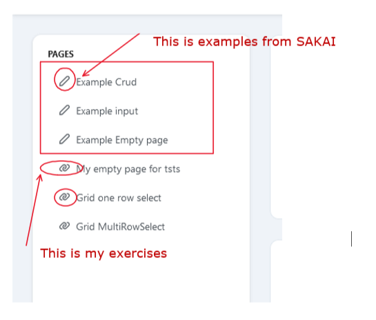
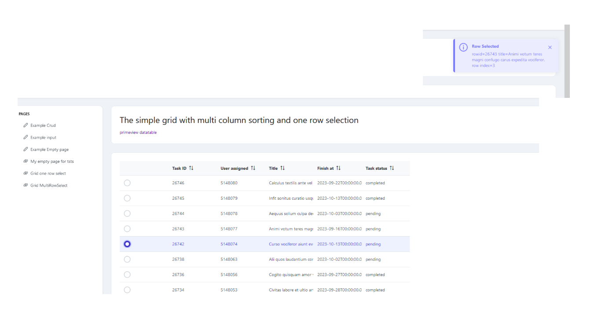
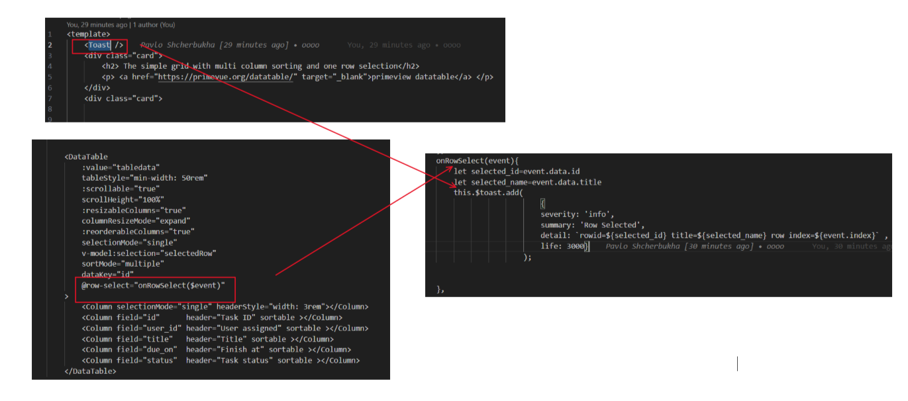
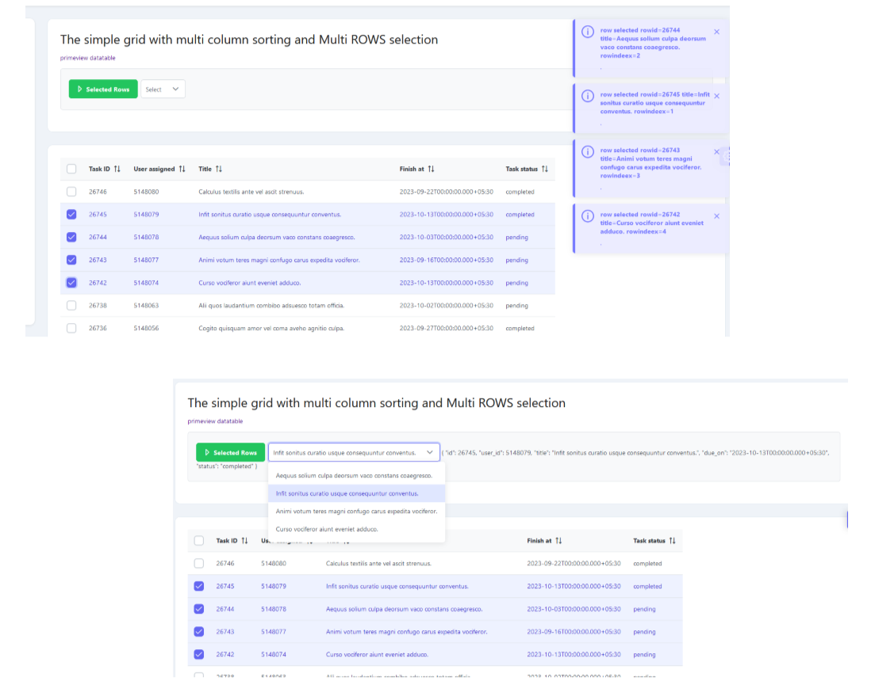
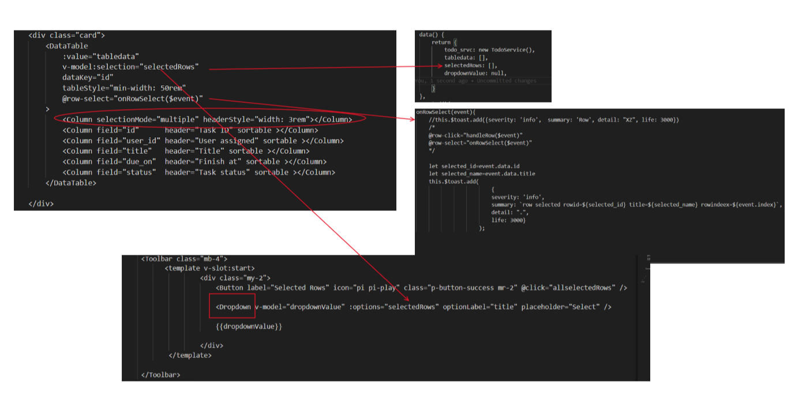
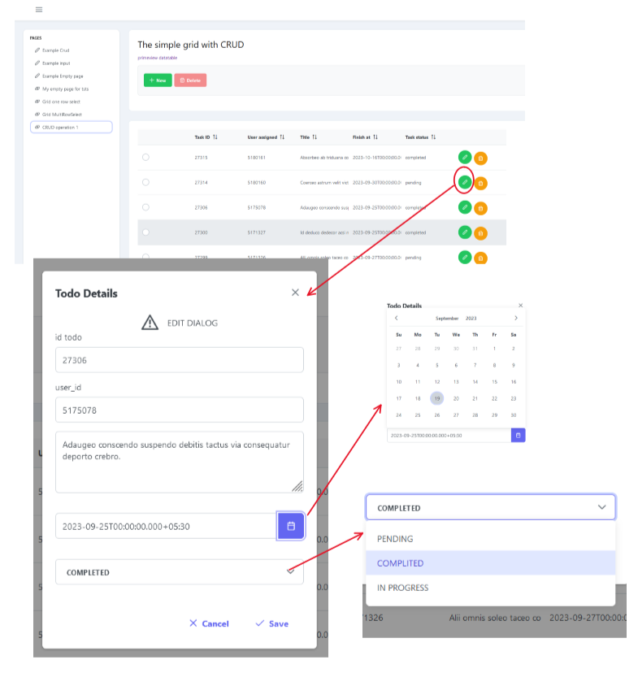
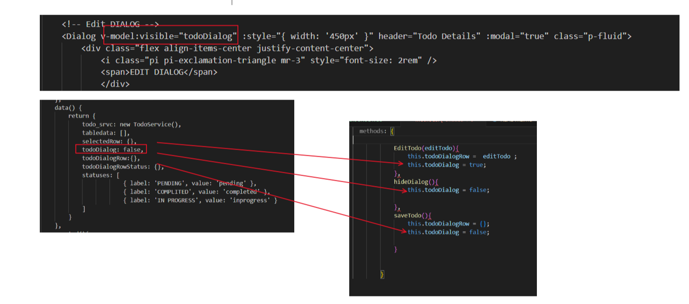

# Learning  primevue using SAKAI template

I have taken [SAKAI template](https://github.com/primefaces/sakai-vue) and customise it for my needs
## Recommended IDE Setup
[VSCode](https://code.visualstudio.com/) + [Volar](https://marketplace.visualstudio.com/items?itemName=Vue.volar) (and disable Vetur) + [TypeScript Vue Plugin (Volar)](https://marketplace.visualstudio.com/items?itemName=Vue.vscode-typescript-vue-plugin).
### Customize configuration
See [Vite Configuration Reference](https://vitejs.dev/config/).
### Project Setup
```sh
npm install
```
#### Compile and Hot-Reload for Development
```sh
npm run dev
```
#### Compile and Minify for Production
```sh
npm run build
```
#### Lint with [ESLint](https://eslint.org/)
```sh
npm run lint
```
## How to cut minimal template from SAKAI.

### Create a minimal vue3 app

```bash
    npm create vue@latest
    npm install primevue primeicons primeflex
```

### Copy main files from SAKAI template to your project

```text
App.vue
min.js
vite.config.js 
``````

### Copy folders  from SAKAI template to your project


```text
# assets contains css
assets

# contains main screen and manu
layout

# contains routers defenition. Do not foget  delete menu which is  not nesesarry
routers

# It is as you wish. This folder contains http calls  
service

# As you wish. Personally I copy only pages catalog
View/pages

#  publoc foder contains themes css
public
```

### Edit routers in routers/index.js

```js
import { createRouter, createWebHashHistory } from 'vue-router';
import AppLayout from '@/layout/AppLayout.vue';

const router = createRouter({
    history: createWebHashHistory(),
    routes: [
        {
            path: '/',
            component: AppLayout,
            children: [
                {
                    path: '/pages/timeline',
                    name: 'timeline',
                    component: () => import('@/views/pages/Timeline.vue')
                },
                {
                    path: '/pages/empty',
                    name: 'empty',
                    component: () => import('@/views/pages/Empty.vue')
                },
                {
                    path: '/pages/crud',
                    name: 'crud',
                    component: () => import('@/views/pages/Crud.vue')
                },
                {
                    path: '/pages/shgrid',
                    name: 'MY PAGE',
                    component: () => import('@/views/pages/SHTable.vue')
                }

            ]
        }
    ]
});

export default router;

```

### Edit menu builder layout/AppMenu.vue

The key "to" should point to the key "path" from router/index.js

```js
<script setup>
import { ref } from 'vue';

import AppMenuItem from './AppMenuItem.vue';

const model = ref([

    {
        label: 'Pages',
        icon: 'pi pi-fw pi-briefcase',
        to: '/pages',
        items: [
            {
                label: 'Crud',
                icon: 'pi pi-fw pi-pencil',
                to: '/pages/crud'
            },
            {
                label: 'Timeline',
                icon: 'pi pi-fw pi-calendar',
                to: '/pages/timeline'
            },
            {
                label: 'Empty',
                icon: 'pi pi-fw pi-circle-off',
                to: '/pages/empty'
            },
            {
                label: 'MyGrid',
                icon: 'pi pi-fw pi-circle-off',
                to: '/pages/shgrid'
            }

        ]
    }
]);
</script>

<template>
    <ul class="layout-menu">
        <template v-for="(item, i) in model" :key="item">
          
            <app-menu-item v-if="!item.separator" :item="item" :index="i"></app-menu-item>
          
            <li v-if="item.separator" class="menu-separator"></li>
        </template>
    <!--    
        <li>
            <a href="https://www.primefaces.org/primeblocks-vue/#/" target="_blank">
                
            </a>
        </li>
    -->    
    </ul>
</template>

<style lang="scss" scoped></style>


```

### run application


```bash
npm run dev

```


## The main menu

For learning I am using  the main menu with the next signs [pic-01](#pic-01)

<kbd></kbd>
<p style="text-align: center;"><a name="pic-01">pic-01</a></p>


## Making different grids without [Composistion api](https://vuejs.org/guide/extras/composition-api-faq.html)

For this exercise I am using the folowing documentation:

- [DataTable](https://primevue.org/datatable/)
- [DataTable events](https://primevue.org/datatable/#api.datatable.events)
- [DropDown](https://primevue.org/dropdown/)
- [Button](https://primevue.org/button/)
- [Toolbar](https://primevue.org/toolbar/)
- [Toast](https://primevue.org/toast/)

###  Grid one row select

This is a simple grid which is used to show table and move across the rows. I am using the radioButton for row selection. This is nothing special, just a table with one row select.
The **Toast** component is shown which row  selected


<kbd></kbd>
<p style="text-align: center;"><a name="pic-02">pic-02</a></p>

A am focusing more on  the idea how to read selected row. How this problem solwed is shown on the [pic-03](#pic-03):


<kbd></kbd>
<p style="text-align: center;"><a name="pic-03">pic-03</a></p>


###  Grid MultiRow select

A am focusing more on  the idea how to read selected rows.  Also, I am using [DropDown](https://primevue.org/dropdown/) for watching selected rows. On the [pic-04](#pic-04) is shown the contens of the window.

<kbd></kbd>
<p style="text-align: center;"><a name="pic-04">pic-04</a></p>


How this problem solwed is shown on the [pic-05](#pic-05):

<kbd></kbd>
<p style="text-align: center;"><a name="pic-05">pic-05</a></p>

### Grid and CRUD operation

CRUD operation  is developed based on [Dialog](https://primevue.org/dialog/) component. This example is not the best approach but is suitable in some cases. This example is dealing with  the  records  in the table on the frontend side (not with the records in the database). But it helps me   build dialogs and working with fields.
The main component is **views/pages/SHTableCRUD.vue**.
The records are loaded in the table using the way as in previous examples. The edit window is shown on [pic-06](#pic-06). 

<kbd></kbd>
<p style="text-align: center;"><a name="pic-06">pic-06</a></p>

The main idea is to use  the most  required edit components: input field, input date, input dropdown.
Let's dip in details. 

- For using one dialog we need: one wariable which controls hide/show dialog. 
On the [pic-07](#pic-07) you can see the variable **todoDialog** and how it can be used when we want show or hide dialog. 

<kbd></kbd>
<p style="text-align: center;"><a name="pic-07">pic-07</a></p>

- We have to pass one row from table into dialog.
For this purpose is used [slots in Column component](https://primevue.org/datatable/#api.column.slots.body).
We creates the virtual column with slot "body" and pass slot property **data** on the  buton **@click** event

```html
            <Column headerStyle="min-width:10rem;">
                <template #body="slotProps">
                    <Button icon="pi pi-pencil" class="p-button-rounded p-button-success mr-2" @click="EditTodo(slotProps.data)" />
                    <Button icon="pi pi-trash" class="p-button-rounded p-button-warning mt-2" @click="ConfirmDelTodo(slotProps.data)" />
                </template>
            </Column>

```
and then we recive  row data in funtion:

```js
    EditTodo(editTodo){
                this.todoDialogRow =  editTodo ;
                this.todoDialog = true;
    }

```
and assigns rowdata to special variable  **todoDialogRow**.


- Designing the edit dialog.

In this dialog all fields are created  using div with **class="field"** 

```html

<!-- Edit DIALOG -->
        <Dialog v-model:visible="todoDialog" :style="{ width: '450px' }" header="Todo Details" :modal="true" class="p-fluid">
                <div class="flex align-items-center justify-content-center">
                    <i class="pi pi-exclamation-triangle mr-3" style="font-size: 2rem" />
                    <span>EDIT DIALOG</span>
                </div>
                <div class="field">
                        <label for="id">id todo</label>
                        <InputText id="id" v-model.trim="todoDialogRow.id" required="true" autofocus :class="{ 'p-invalid': submitted && !todoDialogRow.id }" />
                        <small class="p-invalid" v-if="submitted && !todoDialogRow.id">id is required.</small>
                </div>
                <div class="field">
                        <label for="user_id">user_id</label>
                        <InputText id="user_id" v-model.trim="todoDialogRow.user_id" required="true" autofocus :class="{ 'p-invalid': submitted && !todoDialogRow.user_id }" />
                        <small class="p-invalid" v-if="submitted && !todoDialogRow.user_id">user_id is required.</small>
                </div>
                <div class="field">
                        <label for="title"></label>
                        <Textarea id="title" v-model="todoDialogRow.title" required="true" rows="3" cols="20" />
                </div>
                <div class="field">
                        <label for="due_on"></label>
                        <small class="p-invalid" v-if="submitted && !todoDialogRow.due_on">due_on is required.</small>
                        <Calendar v-model="todoDialogRow.due_on" dateFormat="yy-mm-dd" showIcon />
                </div>
                <div class="field">
                        <label for="status"></label>
                        <small class="p-invalid" v-if="submitted && !todoDialogRow.status">status is required.</small>
                        <Dropdown id="status" v-model="todoDialogRow.status" :options="statuses" optionLabel="label"  optionValue="value" placeholder="Select a Status">
                            <template #value="slotProps">
                               <div v-if="slotProps.value && slotProps.value.value">
                                    <span :class="'product-badge status-' + slotProps.value.value">{{ slotProps.value.label }}</span>
                                </div>
                                <div v-else-if="slotProps.value && !slotProps.value.value">
                                    <span :class="'product-badge status-' + slotProps.value.toLowerCase()">{{ slotProps.value }}</span>
                                </div>
                                <span v-else>
                                    {{ slotProps.placeholder }}
                                </span>
                            </template>
                        </Dropdown>


                </div>
            <template #footer>
                <Button label="Cancel" icon="pi pi-times" class="p-button-text" @click="hideDialog" />
                <Button label="Save" icon="pi pi-check" class="p-button-text" @click="saveTodo" />
            </template>
        </Dialog>        

```

For date entering we use  object [Calendar](https://primevue.org/calendar/). To use date in the custom format it is better using localisation [PrimeVue Locale](https://primevue.org/configuration/#locale). In this example I am using en locale with customised date format: 

```json
import en from  '@/en.json';
const app = createApp(App);
app.use(router);
app.use(PrimeVue, { ripple: true});
PrimeVue.locale = en;

```
In the project is placed Ukrainian locale **uk.json**.


- Next thing is [DropDown](https://primevue.org/dropdown/)


```html

    <Dropdown id="status" v-model="todoDialogRow.status" :options="statuses" optionLabel="label"  optionValue="value" placeholder="Select a Status">
        <template #value="slotProps">
            <div v-if="slotProps.value && slotProps.value.value">
                <span :class="'product-badge status-' + slotProps.value.value">{{ slotProps.value.label }}</span>
            </div>
            <div v-else-if="slotProps.value && !slotProps.value.value">
                <span :class="'product-badge status-' + slotProps.value.toLowerCase()">{{ slotProps.value }}</span>
            </div>
            <span v-else>
                {{ slotProps.placeholder }}
            </span>
        </template>
    </Dropdown>

```

The **options** is referencing on the dropdown dictionary variable:

```js
    statuses: [
                { label: 'PENDING', value: 'pending' },
                { label: 'COMPLITED', value: 'completed' },
                { label: 'IN PROGRESS', value: 'inprogress' }
    ]

```

The **optionLabel** is referencing on the field which should be shown in dropdown.
The **optionValue**  is referencing on the field which should be used as data in dropdown. In case of miss this whole record from dictionary will be assigned.

- Place edited row in the table under correct index.
For this purpose is used functions

```js
saveTodo(){
    let todoid = this.todoDialogRow.id;
    let index=this.findIndexById( todoid );
    if (index > -1){
        this.tabledata[index] = this.todoDialogRow;
        this.todoDialogRow = {};
        this.todoDialog = false;
        this.$toast.add(
                        {
                        severity: 'info', 
                        summary: 'Data stored', 
                        detail: `rowid=${todoid}  index=${index}` , 
                        life: 3000}
                    );

    } else {
            this.$toast.add(
                        {
                        severity: 'error', 
                        summary: 'Data not stored', 
                        detail: `rowid=${todoid}  index=${index}` , 
                        life: 3000}
                    );
        this.todoDialogRow = {};
        this.todoDialog = false;
    }
},            

```
and 

```js 
findIndexById(id){
    let index = -1;
    for (let i = 0; i < this.tabledata.length; i++) {
        if (this.tabledata[i].id === id) {
            index = i;
            break;
        }
    }
    return index;
},

```


